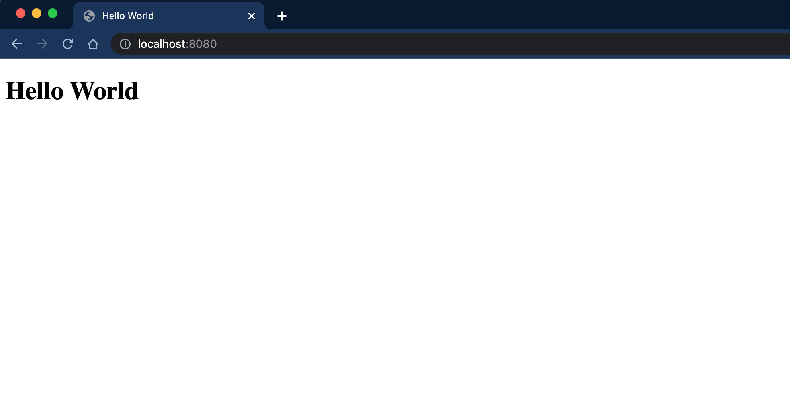
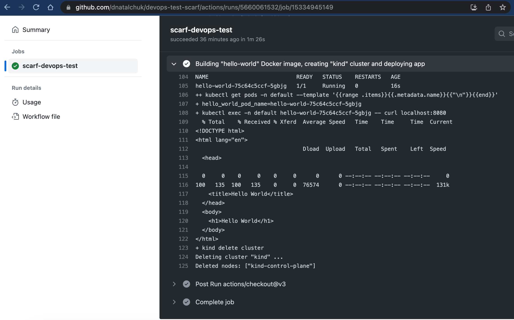

# Devops take home assignment

## Installation
* Go through the kind installation process from their [documentation](https://kind.sigs.k8s.io/docs/user/quick-start/#installation) 

## Task

- Dockerize the `Hello World` website that's located the `src` folder.
- Deploy the `Hello World` website in an nginx reverse proxy in a pod in the kind cluster.
- Access the website from your browser.
- Document the steps on how to run the project.

## Presentation
- To present this project, push it to a github repository when you are done. 
- Setup github actions that builds and tears down the entire cluster with the pod that has the `Hello World` website. 
- Finally, invite the interviewers to the repository.

## Documentation for task execution: 

* Project file structure:

```
.
├── CODEOWNERS
├── README.md
├── cluster.yml
├── shell.nix
├── site-deployment.yml
├── site-service.yml
└── src
    ├── Dockerfile
    ├── index.html
    └── nginx.conf
```

* In the first place, required dependencies/packages like `kind` were installed;
* `Hello World` website has been Dockerized under the `src` folder, `nginx.conf` has been created and Docker image build steps are defined in `src/Dockerfile`. `nginx:alpine` source Docker image has been selected because of smaller image size to improve container build/startup times and reduced resource usage; reduced package set minimizes the attack surface, making the container less susceptible to potential security vulnerabilities, etc.;
* Presenting Docker image build logs below:

```
❯ docker build -t scarf_test:1.0.0 .
[+] Building 1.3s (9/9) FINISHED                                                                                                           docker:desktop-linux
 => [internal] load .dockerignore                                                                                                                          0.1s
 => => transferring context: 2B                                                                                                                            0.0s
 => [internal] load build definition from Dockerfile                                                                                                       0.2s
 => => transferring dockerfile: 369B                                                                                                                       0.1s
 => [internal] load metadata for docker.io/library/nginx:alpine                                                                                            0.0s
 => [1/4] FROM docker.io/library/nginx:alpine                                                                                                              0.0s
 => [internal] load build context                                                                                                                          0.0s
 => => transferring context: 62B                                                                                                                           0.0s
 => CACHED [2/4] WORKDIR /src                                                                                                                              0.0s
 => CACHED [3/4] COPY ./nginx.conf /etc/nginx/nginx.conf                                                                                                   0.0s
 => CACHED [4/4] COPY ./index.html /scarf_hello/                                                                                                           0.0s
 => exporting to image                                                                                                                                     0.0s
 => => exporting layers                                                                                                                                    0.0s
 => => writing image sha256:e2e19e2e171569cd7209f8977e83b2275751b1ce58e30a4483f2340a429d7a86                                                               0.0s
 => => naming to docker.io/library/scarf_test:1.0.0
```

* Once the `Hello World` website Docker has been built - the next `site-deployment.yml` manifest has been updated with container spec point to the `scarf_test:1.0.0` image;

* Next step was to bootstrap/create a kind cluster running the `kind create cluster` command:

```
kind create cluster
Creating cluster "kind" ...
 • Ensuring node image (kindest/node:v1.27.3) 🖼  ...
 ✓ Ensuring node image (kindest/node:v1.27.3) 🖼
 • Preparing nodes 📦   ...
 ✓ Preparing nodes 📦 
 • Writing configuration 📜  ...
 ✓ Writing configuration 📜
 • Starting control-plane 🕹️  ...
 ✓ Starting control-plane 🕹️
 • Installing CNI 🔌  ...
 ✓ Installing CNI 🔌
 • Installing StorageClass 💾  ...
 ✓ Installing StorageClass 💾
Set kubectl context to "kind-kind"
You can now use your cluster with:

kubectl cluster-info --context kind-kind
```

* Once the `kind` cluster was created - the next earlier-built Docker image has been loaded to the kind control plane as below:

```
kind load docker-image scarf_test:1.0.0 --name kind

Image: "scarf_test:1.0.0" with ID "sha256:891dec4137fa2ca770445b5b48ea30bfb0d25e979d10fb649d0df1164b53beb6" not yet present on node "kind-control-plane", loading...
```

* Next, the `Hello World` deployment and service were created and logs are presented below:

```
kubectl apply -f site-deployment.yml
deployment.apps/hello-world created

kubectl get pods -n default
NAME                           READY   STATUS    RESTARTS   AGE
hello-world-75c64c5ccf-5gbjg   1/1     Running   0          16s

kubectl apply -f site-service.yml
service/hello-world-service created
```

* Since we use the `NodePort` service type - in order to access the app locally, `kubectl port-forward service/hello-world-service 8080:8080` command has been executed:

```
❯ kubectl port-forward service/hello-world-service 8080:8080
Forwarding from 127.0.0.1:8080 -> 8080
Forwarding from [::1]:8080 -> 8080
Handling connection for 8080
Handling connection for 8080
```


## GitHub actions implementation details:



* GitHub actions logic is defined as below:

```
name: Scarf Hello-World presentation

on:
  push:
    branches: [ "master" ]
  pull_request:
    branches: [ "master" ]

jobs:
  scarf-devops-test:
    runs-on: ubuntu-latest

    steps:
    - uses: actions/checkout@v3
    - name: Building "hello-world" Docker image, creating "kind" cluster and deploying app
      run: ./.github/scripts/deploy.sh
      shell: bash
```
* All Docker image build and deployment logic is defined in `./.github/scripts/deploy.sh` bash script;

## Additional notes:

* This implementation is not production-ready and there are opportunities for further improvements/optimizations, like speeding up GitHub Actions execution via creating a dedicated GitHub runner with baked packages/dependencies installed, etc., implementing git and Docker image tagging flow, like automatically creating/bumping git tag for each change to the master branch and map it with the Docker image tag, to have always 121 mapping for code change and resulted in image;

* There are also opportunities for redesigning and rearchitecting application, like for serving static content purposes to use CDN-like solutions (AWS CloudFront, Cloudflare) to achieve operational and cost optimizations;